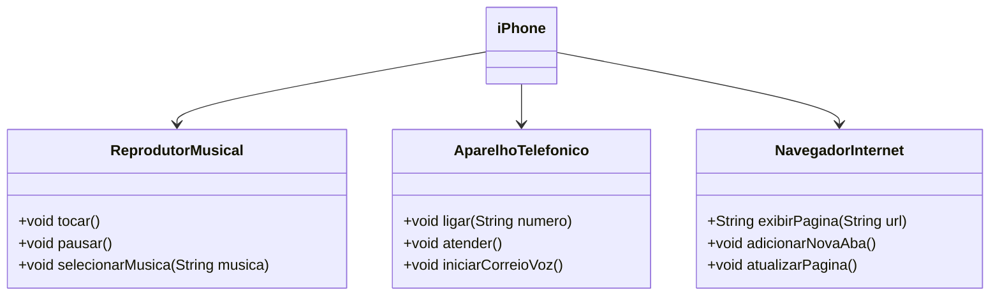

# Implementação da Interface iPhone

Este projeto demonstra uma implementação em Java de uma classe `Iphone` que adere às interfaces para um reprodutor musical (`ReprodutorMusical`), um dispositivo telefônico (`AparelhoTelefonico`) e um navegador de internet (`NavegadorInternet`). A classe `Iphone` fornece métodos concretos para tocar música, fazer chamadas telefônicas e navegar na internet.

## Estrutura do Projeto

O projeto está organizado em diferentes pacotes para manter uma estrutura limpa:

- `com.apple.iphone`: Contém a classe principal `Iphone`.
- `com.apple.iphone.musica`: Contém a interface `ReprodutorMusical`.
- `com.apple.iphone.telephone`: Contém a interface `AparelhoTelefonico`.
- `com.apple.iphone.browser`: Contém a interface `NavegadorInternet`.

### Exemplo de Diagrama UML (Mermaid)


## Interfaces

### ReprodutorMusical

Define os métodos para um reprodutor musical.

```java
public interface ReprodutorMusical {
    void tocar();
    void pausar();
    void selecionarMusica(String musica);
}
```

### AparelhoTelefonico

Define os métodos para um dispositivo telefônico.

```java
public interface AparelhoTelefonico {
    void ligar(String numero);
    void atender();
    void iniciarCorreioVoz();
}
```

### NavegadorInternet

Define os métodos para um navegador de internet.

```java
public interface NavegadorInternet {
    String exibirPagina(String url);
    void adicionarNovaAba();
    void atualizarPagina();
}
```

## Classe iPhone

A classe `Iphone` implementa todas as três interfaces e fornece implementações concretas para cada método.

```java
package com.apple.iphone;

import com.apple.iphone.musica.*;
import com.apple.iphone.telephone.*;
import com.apple.iphone.browser.*;

public class Iphone implements ReprodutorMusical, AparelhoTelefonico, NavegadorInternet {

    @Override
    public void tocar() {
        System.out.println("Tocando música");
    }

    @Override
    public void pausar() {
        System.out.println("Música pausada");
    }

    @Override
    public void selecionarMusica(String musica) {
        System.out.println("Música selecionada: " + musica);
    }

    @Override
    public void ligar(String numero) {
        System.out.println("Ligando para: " + numero);
    }

    @Override
    public void atender() {
        System.out.println("Atendendo a chamada");
    }

    @Override
    public void iniciarCorreioVoz() {
        System.out.println("Iniciando correio de voz");
    }

    @Override
    public String exibirPagina(String url) {
        return "Exibindo página: " + url;
    }

    @Override
    public void adicionarNovaAba() {
        System.out.println("Nova aba adicionada");
    }

    @Override
    public void atualizarPagina() {
        System.out.println("Página atualizada");
    }
}
```

## Como Usar

1. Certifique-se de ter um ambiente de desenvolvimento Java configurado.
2. Crie a estrutura de pacotes necessária conforme mostrado acima.
3. Implemente as interfaces em seus respectivos pacotes.
4. Implemente a classe `Iphone` no pacote `com.apple.iphone`.
5. Compile e execute a classe `Iphone` para testar os métodos.

## Exemplo de Uso

Aqui está um trecho de código exemplo para demonstrar o uso da classe `Iphone`:

```java
public class Main {
    public static void main(String[] args) {
        Iphone iphone = new Iphone();

        // Testar a funcionalidade do reprodutor musical
        iphone.tocar();
        iphone.pausar();
        iphone.selecionarMusica("Imagine - John Lennon");

        // Testar a funcionalidade do telefone
        iphone.ligar("123456789");
        iphone.atender();
        iphone.iniciarCorreioVoz();

        // Testar a funcionalidade do navegador
        System.out.println(iphone.exibirPagina("https://www.apple.com"));
        iphone.adicionarNovaAba();
        iphone.atualizarPagina();
    }
}
```

>Este projeto fornece uma implementação básica de uma classe `Iphone` que pode funcionar como um reprodutor musical, um telefone e um navegador de internet. Seguindo a estrutura e o código fornecidos, você pode expandir e personalizar as funcionalidades conforme suas necessidades.
